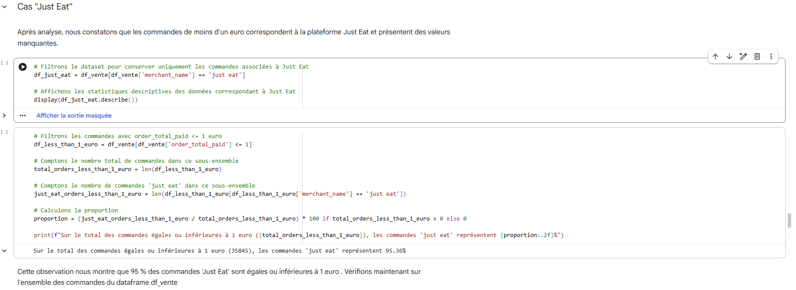
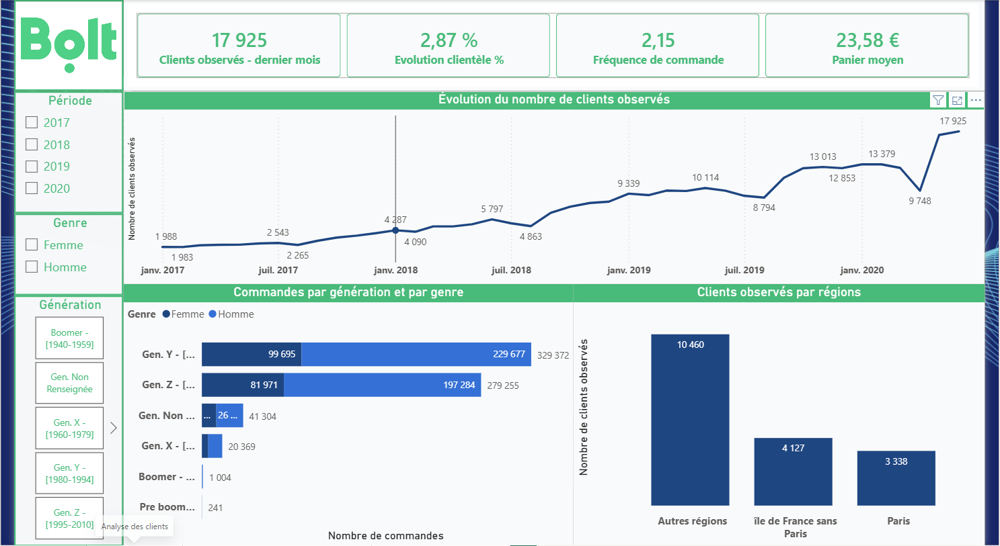
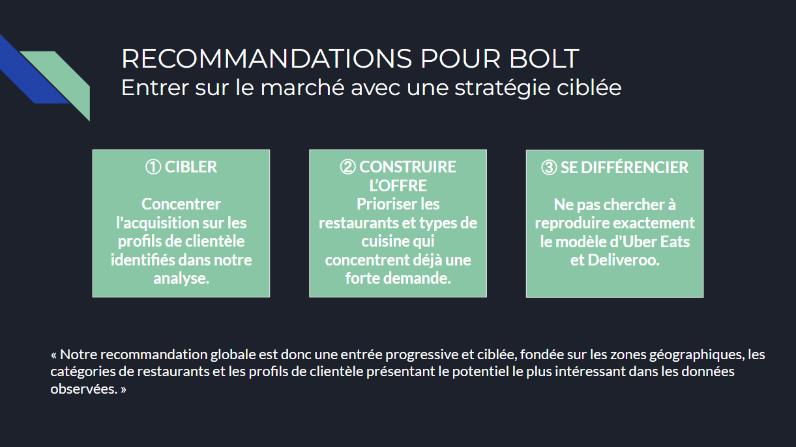

# Projet FoxIntelligence : Bolt Food - En route pour la France !

**Analyse du marché français de la livraison de repas et recommandations stratégiques pour le lancement de Bolt Food.**

## 🎯 Compétences Démontrées
* **Data Cleaning & Wrangling (Python : Pandas, NumPy)** : Traitement des valeurs manquantes, formatage des séries temporelles et identification des anomalies métiers (ex: filtrage des commandes Just Eat < 1€).
* **Analyse Statistique (SciPy)** : Détection et traitement des valeurs aberrantes via la méthode de l'écart interquartile (IQR).
* **Data Visualisation (Matplotlib, Seaborn, Power BI)** : Création d'un dashboard interactif et de graphiques orientés prise de décision.
* **Business Analysis** : Traduction d'un grand volume de transactions brutes en recommandations stratégiques pour l'entrée sur un nouveau marché.

## 📖 Contexte et Problématique
Bolt souhaite se lancer sur le marché très concurrentiel de la livraison de repas en France. L'objectif de cette analyse est de comprendre la structure de l'offre (acteurs dominants), d'identifier les consommateurs cibles (évolution et profils) et de définir les axes de développement prioritaires pour réussir cette implantation.

## 🔍 Données et Périmètre d'Analyse
L'analyse s'appuie sur des données de commandes fournies par FoxIntelligence, couvrant la période de 2017 à juin 2020.
* **Données initiales** : Trois tables ont été exploitées : Transactions (807 676 lignes), Produits (1 711 616 lignes) et Clients (378 lignes).
* **Périmètre final** : La plateforme Just Eat a été exclue de l'analyse (34 183 lignes retirées) car plus de 95 % de ses commandes présentaient un montant inférieur ou égal à 1 euro, signalant une anomalie. La table Produits a également été écartée pour éviter les biais de double comptage. L'étude se concentre donc sur 671 545 transactions dominées par Uber Eats et Deliveroo.

## 📊 Résultats Clés

* **Un marché concentré** : L'offre est dominée par Uber Eats (en volume et en chiffre d'affaires), mais la restauration reste très diversifiée avec 32 catégories de restaurants observées.
* **Une cible claire** : La clientèle observée a été multipliée par environ 9 depuis 2017 et se concentre principalement sur les générations Y et Z.
* **Une demande localisée** : La demande est fortement concentrée géographiquement et autour de types de cuisines spécifiques.

## 🚀 Recommandations Stratégiques

1. **Cibler** : Concentrer l'acquisition client sur les générations Y et Z identifiées dans l'analyse.
2. **Construire l'offre** : Prioriser les partenariats avec les types de cuisines et les restaurants situés dans les zones où la demande est déjà forte.
3. **Se différencier** : Proposer un positionnement ciblé sans chercher à reproduire immédiatement le modèle exact d'Uber Eats ou de Deliveroo.

## 🛠️ Structure du Dépôt et Installation
* `/notebooks/main.ipynb` : Script Python détaillant le nettoyage et l'exploration des données.
* `/livrables/dashboard_bolt.pbix` : Outil interactif de visualisation des KPI du marché.
* `/livrables/presentation_recommandations.pptx` : Support de présentation des recommandations.

**Pour explorer le projet :**
1. Clonez ce dépôt : `git clone https://github.com/[votre-nom-utilisateur]/foxintelligence_bolt.git`
2. Installez les librairies requises (Pandas, NumPy, Matplotlib, Seaborn, SciPy).

*Note : Les jeux de données sources de FoxIntelligence sont confidentiels et ne sont pas inclus dans ce dépôt. Vous pouvez néanmoins consulter l'intégralité du code de traitement et de la démarche analytique dans le dossier `/notebooks`.*

## 👤 Auteurs
Projet d'analyse de données réalisé en binôme.
* **[Coralie Wagner]** - *Data Analyst* - [Lien LinkedIn](URL)
* **[Mike Laurent]** - *Data Analyst* - [Lien LinkedIn](URL)